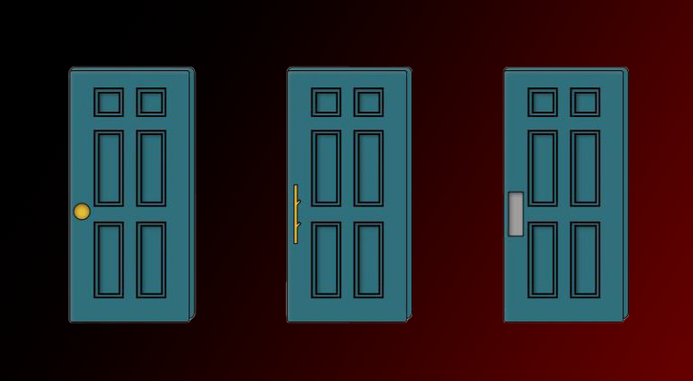

> ##### Design is the angular stone of any Human-Computer Interface (HCI).

It defines the way a user interacts with a system and how the system reacts to the user's actions. 

A good design is one that is intuitive and easy to use. 

It is the designer's job to make sure that the user can easily understand how to use the system and that the system reacts in a way that is expected by the user.

##### **In this article, I will go over the different aspects of a good design and the rules to follow to achieve them.**

---

#### Affordance

Affordance is the property of an object that allows an individual to know how to use it.

As an image is worth a thousand words, here is an example of a door handle that has a good affordance.

Each of these doors has a different handle. And each of these handles has a good affordance.

What that means, in this example, is that the user can easily understand how to use the handle to open the door: 

**The left door has a handle that can be twisted, the middle door should be pulled and the right door should be pushed.**

Here are some examples from my daily life of objects that have a good and bad affordance:

##### Good Affordance

This toaster has a good affordance.
The big handle and dial are straightforward and the user can easily understand that the dial is used to set the toasting time and that the handle is used to start the toasting process.

 

Having to guess that this round plastic piece hides a pop-up electrical plug is not a good affordance (proof is that my roommates and I discovered it after months of living here).

--- 

#### Gestalt's Laws

Gestalt's laws are a set of rules that define how the human brain perceives visual elements.
These laws claim that color, shape, size, proximity and orientation are the main factors that influence the way we perceive visual elements.

**In this section, I will go over some of the laws and how they can be used to create a good design :**

*As illustrated by this blog post's miniature, these laws can be used to create a good design.*
- **Law of Proximity** : Elements that are close to each other are perceived as a group.
- **Law of Similarity** : Elements that are similar to each other are perceived as a group.
- **Law of Closure** : The brain tends to fill in the gaps of incomplete shapes.
- **Law of Continuity** : The brain tends to perceive continuous lines rather than discontinuous ones.
- **Law of Common Region** : Elements that are in the same region are perceived as a group.
- **Law of Prägnanz (or Law of Good Figure)** : The brain tends to perceive simple shapes rather than complex ones.

---

#### Dark Designs

Dark designs are unethical designs that are made to trick the user into doing something they don't want to do, like buying or subscribing to something.
Dark designs are not to mistake with bad designs, which unintendedly make the navigation through their page confusing.

The term "Dark Design" was coined by publicist Harry Brignull in 2010. He created a website called [Dark Patterns](https://www.darkpatterns.org/) that lists the different types of dark designs, the laws protecting users in various countries or even a "Wall of Shame" that exposes the misdeeds of companies that use dark designs.

**In this section, I will go over some of the most common dark designs and how to avoid them [^1] :**

- **Nagging** : The user is nagged into doing something by being repeatedly asked to do it. For example, a website that asks you to subscribe to their newsletter every time you visit it.

- **Obstruction** : The user is prevented from doing something by making it difficult to find or access. For example, a website that makes it difficult to unsubscribe from their newsletter.

- **Confirmshaming** : The user is shamed into doing something by being made to feel guilty for not doing it. For example, a website that asks you if you want to subscribe to their newsletter and the "No" button is labeled "No, I don't want to improve my life".

- **Disguised Ads** : Ads that are disguised as other kinds of content or navigation, in order to get you to click on them. For example, a website that has a "Download" button that is actually an ad.

---

#### Conclusion

**Design is a very important aspect of any Human-Computer Interface (HCI)**. It is important for developper and project managers to maintain a fluid and intuitive design to ensure a good user experience. 

Beyond being annoying, *bad designs are unethical and can be seen as taking advantage over less digitaly literate users such as elderly or visually impaired people.*

#### Sources

[^1]: All dark design images were provided by [darkpatterns.org](https://www.darkpatterns.org/)